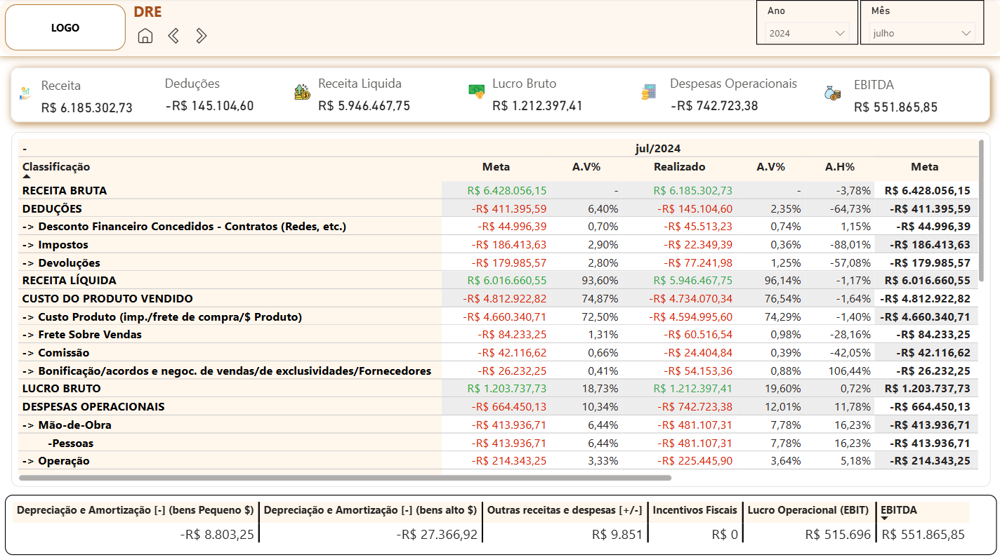

# Portfólio Power BI 📊

Dashboards elaborados com foco em estudos na ferramenta Power BI, visando construir um portfólio com cenários reais do dia a dia:

## Dashboards

- **Dashboard Financeiro - Distribuidora**

## Dashboard Financeiro - Distribuidora

### Exemplo de funcionamento

Acesse o dashboard completo neste link: [Dashboard Financeiro](https://app.powerbi.com/reportEmbed?reportId=4c82f488-5edb-4329-8c8c-e9a6534f26d5&autoAuth=true&ctid=459a2760-1c87-4261-8ffc-987f128e9c61)

---

## Estrutura da base de dados

Originalmente a consulta se daria via Fluxo de Dados Gen2, através de uma conexão SQL Server que ligava diretamente a base de dados da empresa.

Por questões de proteção de dados, as fontes foram trocadas por planilhas .xlsx que seguem a mesma modelagem da base original, as tabelas principais são:

- DIM_CATEGORIA (Categoria de contas de produtos)
- DIM_CONTA (Contas de receitas e despesas) 
- DIM_FORNECEDOR (Fornecedores de produtos)
- DIM_GRUPO (Grupos de contas) 
- DIM_PRODUTO (Produtos Ofertados)
- DIM_SEÇÃO (Classe de produtos)
- FATO_DEVOLUCAO (Valores de produtos devolvidos)
- FATO_FINANC (Valores das operações realizadas) 
- FATO_LANCAMENTO (Valores de lançamentos internos da companhia) 
- FATO_MARGEM (Valores de Margens de Lucro)
- FATO_META_RECEITA (Valores de Metas)

**Quantidade de dados:** >1.000.000
